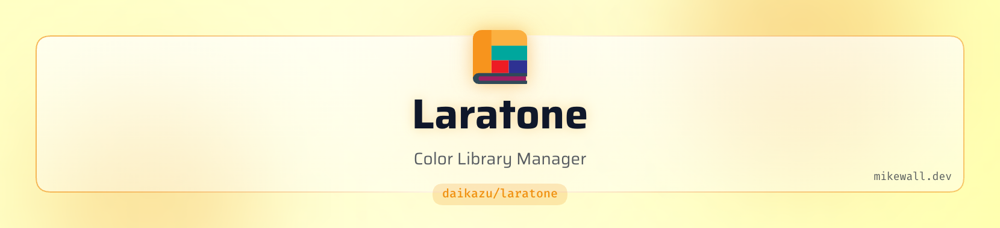

<a href="https://mikewall.dev">
<picture>
  <source media="(prefers-color-scheme: dark)" srcset="art/header-dark.png">
  
</picture>
</a>

# Laratone

[](https://packagist.org/packages/daikazu/laratone)
[](https://github.com/daikazu/laratone/actions?query=workflow%3Arun-tests+branch%3Amain)
[](https://packagist.org/packages/daikazu/laratone)

Laratone is a comprehensive Laravel package for managing color libraries and swatches in your applications. It provides an easy-to-use API for storing, retrieving, and managing color data, with built-in support for various color formats (HEX, RGB, CMYK, LAB) and popular color libraries.

## Features

- Multiple built-in color libraries (Pantone, GuangShun Thread, HC Twill)
- **Auto-calculation of RGB, CMYK, and LAB from hex values**
- Configurable white point reference for LAB color calculations
- Automatic color data caching with configurable TTL
- Easy color book management and seeding
- Flexible REST API with filtering, sorting, and pagination
- Rate-limited API endpoints for security
- Type-safe color value casting (LAB, RGB, CMYK)
- Full PHP 8.4 support with strict typing throughout

## Requirements

- PHP 8.4 or higher
- Laravel 12.x or greater

> **Note:** For PHP 8.3 / Laravel 11 support, use version 4.x of this package.

## Installation

You can install the package via composer:

```bash
composer require daikazu/laratone
```

### Publish Configuration and Migrations

Publish the configuration file:

```bash
php artisan vendor:publish --tag="laratone-config"
```

Publish and run the migrations:

```bash
php artisan vendor:publish --tag="laratone-migrations"
php artisan migrate
```

## Configuration

The published config file (`config/laratone.php`) contains the following options:

```php
return [
    // Table prefix for Laratone tables
    'table_prefix' => 'laratone_',

    // Cache duration in seconds for color books and colors
    'cache_time' => 3600,

    // Reference white point for LAB color calculations
    // Options: 'D50' (print), 'D55', 'D65' (daylight, default), 'D75'
    'white_point' => 'D65',
];
```

### White Point Options

When RGB, CMYK, or LAB values are not provided, they are automatically calculated from the hex value. LAB calculations require a reference white point (illuminant):

| Value | Description | Use Case |
|-------|-------------|----------|
| `D50` | Warm white (~5000K) | Print/graphic arts |
| `D55` | Mid-morning daylight (~5500K) | Photography |
| `D65` | Standard daylight (~6500K) | **Default**, web/screen |
| `D75` | North sky daylight (~7500K) | Scientific applications |

## Usage

### Seeding Color Books

Laratone comes with several pre-built color libraries:

- `ColorBookPlusSolidCoated`
- `ColorBookPlusSolidCoated336NewColors`
- `ColorBookMetallicCoated`
- `ColorBookPlusMetallicCoated`
- `GuangShunThreadColors`
- `HCTwillColors`

#### Seed All Color Books
```bash
php artisan laratone:seed
```

#### Seed Specific Color Books
```bash
php artisan laratone:seed ColorBookPlusSolidCoatedSeeder
```

#### Import Custom Color Books
```bash
php artisan laratone:seed --file ./mycolorbookfile.json
```

Example Color Book format:
```json
{
  "name": "My Custom Color Book",
  "data": [
    {
      "name": "Custom Color 1",
      "hex": "FEDD00"
    },
    {
      "name": "Custom Color 2",
      "hex": "FF5500",
      "lab": "88.19,-6.97,111.73",
      "rgb": "254,221,0",
      "cmyk": "0,1,100,0"
    }
  ]
}
```

> **Note:** Only `name` and `hex` are required. RGB, CMYK, and LAB values are optional and will be auto-calculated from hex if not provided. If you have official color values (e.g., Pantone LAB values), include them to use those instead of calculated values.

## REST API

### Color Books

List all available color books:

```http
GET /api/laratone/colorbooks
```

| Parameter | Required | Description | Default |
|-----------|:--------:|-------------|:-------:|
| sort      | No       | Sort by name (asc/desc) | - |

### Colors

Get colors from a specific color book:

```http
GET /api/laratone/colorbook/{slug}
```

| Parameter | Required | Description | Default |
|-----------|:--------:|-------------|:-------:|
| sort      | No       | Sort by name (asc/desc) | - |
| limit     | No       | Limit number of results | - |
| random    | No       | Randomize results (1/true) | false |

> **Note:** When using `random=true`, results are not cached to ensure different results on each request.

### Rate Limiting & Custom Middleware

Laratone routes use a `laratone` middleware alias that does nothing by default. You can replace it with your own middleware to add rate limiting, authentication, or other functionality.

To add rate limiting, define the `laratone` middleware alias in your application's bootstrap:

```php
// bootstrap/app.php (Laravel 11+)
->withMiddleware(function (Middleware $middleware) {
    $middleware->alias([
        'laratone' => \Illuminate\Routing\Middleware\ThrottleRequests::class . ':60,1',
    ]);
})
```

Or in a service provider:

```php
// app/Providers/AppServiceProvider.php
use Illuminate\Routing\Router;

public function boot(Router $router): void
{
    $router->aliasMiddleware('laratone', \App\Http\Middleware\YourCustomMiddleware::class);
}
```

You can create a custom middleware class that combines multiple behaviors:

```php
// app/Http/Middleware/LaratoneApiMiddleware.php
namespace App\Http\Middleware;

use Closure;
use Illuminate\Routing\Middleware\ThrottleRequests;

class LaratoneApiMiddleware extends ThrottleRequests
{
    public function handle($request, Closure $next, $maxAttempts = 60, $decayMinutes = 1, $prefix = '')
    {
        // Add custom logic here (authentication, logging, etc.)
        return parent::handle($request, $next, $maxAttempts, $decayMinutes, $prefix);
    }
}
```

## Programmatic Usage

Laratone provides a simple API for managing colors programmatically:

```php
use Daikazu\Laratone\Facades\Laratone;

// Get all color books with colors
$colorBooks = Laratone::colorBooks();

// Get a specific color book by slug
$colorBook = Laratone::colorBookBySlug('color-book-plus-solid-coated');

// Create a new color book
$newColorBook = Laratone::createColorBook('My New Color Book');

// Create with custom slug
$newColorBook = Laratone::createColorBook('My Color Book', 'custom-slug');

// Add a single color to a color book (only hex required)
$color = Laratone::addColorToBook($colorBook, [
    'name' => 'New Color',
    'hex' => 'FF0000',
]);

// Or with explicit values (these take precedence over calculated values)
$color = Laratone::addColorToBook($colorBook, [
    'name' => 'Pantone Red',
    'hex' => 'FF0000',
    'lab' => '53.23,80.11,67.22',  // Official Pantone LAB value
]);

// Add multiple colors at once
$colors = Laratone::addColorsToBook($colorBook, [
    ['name' => 'Red', 'hex' => 'FF0000'],
    ['name' => 'Green', 'hex' => '00FF00'],
    ['name' => 'Blue', 'hex' => '0000FF'],
]);

// Get all colors from a color book
$colors = Laratone::getColorsFromBook($colorBook);

// Update a color
Laratone::updateColor($color, ['name' => 'Updated Color Name']);

// Delete a color
Laratone::deleteColor($color);

// Clear cache manually
Laratone::clearCache();
```

## Working with Color Models

Color values are automatically cast to associative arrays when accessed. If a value wasn't stored in the database, it will be **automatically calculated from the hex value**:

```php
use Daikazu\Laratone\Models\Color;

$color = Color::first();

// Access color values as arrays
$color->hex;  // 'FF0000' (required, always stored)
$color->rgb;  // ['r' => 255, 'g' => 0, 'b' => 0] (stored or calculated)
$color->lab;  // ['l' => 53.23, 'a' => 80.11, 'b' => 67.22] (stored or calculated)
$color->cmyk; // ['c' => 0, 'm' => 100, 'y' => 100, 'k' => 0] (stored or calculated)

// Access the parent color book
$colorBook = $color->colorBook;
```

### Auto-Calculation Behavior

- **Hex is required** - All colors must have a hex value
- **Other values are optional** - RGB, CMYK, and LAB are calculated from hex if not provided
- **Stored values take precedence** - If you provide explicit values (e.g., official Pantone LAB), those are used instead of calculated values
- **LAB uses white point config** - Calculated LAB values use the `white_point` setting from your config

## Caching

Laratone automatically caches color book and color data to improve performance. The cache works with any Laravel cache driver, including file, database, Redis, and Memcached.

Cache is automatically cleared when:
- Creating a new color book
- Adding, updating, or deleting colors

To manually clear the cache:

```php
Laratone::clearCache();
```

## Upgrading

See [UPGRADE.md](UPGRADE.md) for upgrade instructions between major versions.

## Testing

```bash
composer test
```

## Contributing

Please see [CONTRIBUTING](CONTRIBUTING.md) for details.

## Security Vulnerabilities

Please review [our security policy](../../security/policy) on how to report security vulnerabilities.

## Credits

- [Mike Wall](https://github.com/daikazu)
- [All Contributors](../../contributors)

## License

The MIT License (MIT). Please see [License File](LICENSE.md) for more information.
